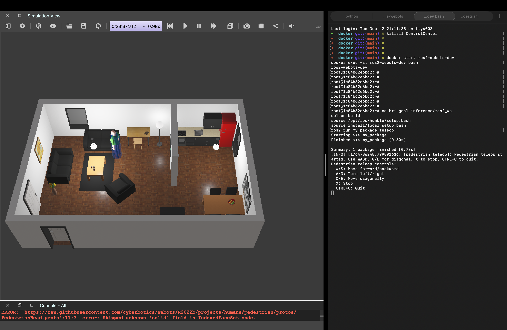

# hri-goal-inference

# System Requirements
- MacOS system
- [Install Webots](https://cyberbotics.com/doc/guide/installation-procedure#from-the-installation-file) (R2022b recommended)
- [Install Docker Desktop](https://www.docker.com/products/docker-desktop)
- Install Python 3

# Quick Start (Recommended)

## One-Command Setup
Clone this repo and run the automated setup script:
```bash
git clone https://github.com/IshitaBadole/hri-goal-inference.git
cd hri-goal-inference
chmod +x setup.sh
./setup.sh
```

The setup script will:
- Verify prerequisites (Docker, Webots)
- Create required directories (`$HOME/webots_shared`, `$HOME/webots_server`)
- Create Python virtual environment and install dependencies
- Build the Docker image
- Create and configure the container
- Clone and build the ROS2 package inside the container

## Running Experiments

Once setup is complete, run an experiment with a single command:
```bash
chmod +x run_experiment.sh
./run_experiment.sh <participant_id> <world> <scenario_no>
```

**Example:**
```bash
./run_experiment.sh p1 apartment.wbt 1
```

**Available worlds:**
- `apartment.wbt`
- `break_room.wbt`
- `factory.wbt`
- `hall.wbt`
- `my_world.wbt` (default arena with obstacles)

The experiment script will:
- Automatically start all 3 required terminals using tmux
- Launch webots-server, ROS launcher, and teleop in the correct order
- Attach you to the teleop window for immediate control
- Save logs to `$HOME/webots_server/pedestrian_logs/<participant_id>_<world>_<scenario_no>.csv`

**Teleop Instructions:**
Keep focus in the teleop terminal. Use the following keys to move the pedestrian:
- `W/S`: Move forward/backward
- `A/D`: Turn left/right
- `Q/E`: Move diagonally
- `X`: Stop
- `Ctrl+C`: Quit teleop

For best experience, drag the Webots window and teleop terminal side-by-side on the same screen. 

**Tmux controls:**
- Switch windows: `Ctrl+b` then `0/1/2`
- Scroll in window: `Ctrl+b` then `[`
- Detach session: `Ctrl+b` then `d`
- Reattach session: `tmux attach -t hri_experiment_<participant_id>_<scenario_no>`

**To stop the experiment:**
1. Stop teleop (window 2): `Ctrl+C`
2. Stop ROS launcher (window 1): `Ctrl+C`
3. Stop webots-server (window 0): `Ctrl+C`
4. Exit session: `Ctrl+b` then `:kill-session`

---

# Manual Setup (Alternative)

If you prefer to set up manually or need to troubleshoot, follow these detailed steps:

## Initial one-time setup
Clone this repo
```
git clone https://github.com/IshitaBadole/hri-goal-inference.git
cd hri-goal-inference
```

Create Python virtual environment and install dependencies
```
python3 -m venv venv
source venv/bin/activate
pip install -r requirements.txt
```

Build the ROS2-Humble Docker image from the Dockerfile
```
cd <path to repo>/hri-goal-inference/docker
docker build -t ros2-humble-webots .
```

Create `webots_shared` and `webots_server` directories in the root directory.
```
mkdir -p "$HOME/webots_shared"
mkdir -p "$HOME/webots_server/pedestrian_logs"
```

Create and run a new container `ros2-webots-dev` from the image.
Mount `$HOME/webots_shared` (Mac) to `/root/shared` (container).
Mount `$HOME/webots_server` (Mac) to `/root/webots_server` (container) for persistent logs.
Set the environment variable for webots-server.
```
docker run -it --name ros2-webots-dev \
  -v $HOME/webots_shared:/root/shared \
  -v $HOME/webots_server:/root/webots_server \
  -e WEBOTS_SHARED_FOLDER="$HOME/webots_shared:/root/shared" \
  ros2-humble-webots
```

Start and enter the container
```
docker start ros2-webots-dev
docker exec -it ros2-webots-dev bash
```

Clone the repo inside the container. This is required because the repo contains all the launchers and modules associated with the ROS2 package.
```
git clone https://github.com/IshitaBadole/hri-goal-inference.git
```

## After Initial Setup
The experiment runs by having three terminals running simultaneously.

### Terminal 1: Run the local simulation server script on your local machine (NOT inside container)
```
cd $HOME/webots_shared
export WEBOTS_HOME=/Applications/Webots.app
curl -O https://raw.githubusercontent.com/cyberbotics/webots-server/master/local_simulation_server.py
python3 local_simulation_server.py
```
NOTE : Change the WEBOTS_HOME variable if the directory in which Webots is installed is different.

### Terminal 2: Launch Webots from inside the container

Start and enter the container
```
docker start ros2-webots-dev
docker exec -it ros2-webots-dev bash
```

Build the package
```
cd hri-goal-inference/ros2_ws
colcon build
source /opt/ros/humble/setup.bash
source install/local_setup.bash
```

Run the launch commands with the world, participant_id and scenario_no arguments as follows:
```
# Run experiment with break room world, participant p1, and scenario 1
ros2 launch my_package robot_launch.py world:=break_room.wbt participant_id:=p1 scenario_no:=1
```

The available world arguments are:
- `apartment.wbt`
- `break_room.wbt`
- `factory.wbt`

ROS2 will launch the corresponding world in WeBots and the logs will get generated for the correponding participant and scenario. Keep this terminal running.

### Terminal 3: Run teleop script inside the container

Start and enter the container
```
docker start ros2-webots-dev
docker exec -it ros2-webots-dev bash
```

Build the package
```
cd hri-goal-inference/ros2_ws
colcon build
source /opt/ros/humble/setup.bash
source install/local_setup.bash
ros2 run my_package teleop
```

> **Teleop Instructions**
> Keep focus in the teleop terminal by clicking in it. Use the teleop keys to move the pedestrian around in Webots. For best experience, drag the Webots window and teleop terminal on the same screen. Ensure that the focused window is the teleop terminal.

# End the experiment

Press `Ctrl+C` in Terminal 3 where teleop module is running to stop the teleop.

Press `Ctrl+C` in Terminal 2 where the pedestrain driver is running to close WeBots.

Press `Ctrl+C` in Terminal 1 to stop the local simulation server.

# Check experiment logs

On your local machine
```
cd $HOME/webots_server/pedestrian_logs
ls
```

You will see the log files for the participant id and scenario no. you passed in the launch arguments.

The log file name format is: `<participant_id>_<world>_<scenario_no>.csv ` (ex. p1_apartment_s1.csv)

View the logs
```
cat <log file name>
```

# Run Clustering

After completing an experiment, analyze the trajectory and visualize goal clusters:

```bash
chmod +x run_clustering.sh
./run_clustering.sh <participant_id> <world> <scenario_no> [options]
```

**Example:**
```bash
./run_clustering.sh p1 apartment.wbt 1
```

**With custom parameters:**
```bash
./run_clustering.sh p1 apartment.wbt 1 --eps 0.2 --min-samples 15 --start-row 3500 --step 10 --image-size 200 200
```

**Optional parameters:**
- `--eps <value>`: DBSCAN epsilon parameter (default: 0.15)
- `--min-samples <value>`: DBSCAN min_samples parameter (default: 10)
- `--start-row <value>`: Offset to start trajectory analysis (default: 3500)
- `--step <value>`: Sampling frequency of trajectory (default: 10)
- `--image-size <w> <h>`: Image resizing dimensions (default: 200 200)

The script will:
- Automatically locate the log file from `$HOME/webots_server/pedestrian_logs/`
- Use the corresponding world image from the `media/` directory
- Run clustering analysis with your chosen parameters
- Display visualization with detected goal clusters

---

## Manual Clustering Command

If you prefer to run clustering manually with custom trajectory and image files:

Usage:
```bash
python3 notebooks/find_goals.py <trajectory path> <world PNG path> [options]
```

Basic example:
```bash
python3 notebooks/find_goals.py trajectory/pedestrian_positions_20251124_064305.csv media/.apartment_cropped.jpg
```

For example (with all options):
```bash
python3 notebooks/find_goals.py trajectory/pedestrian_positions_20251124_064305.csv media/.apartment_cropped.jpg --eps 0.2 --min-samples 15 --start-row 3500 --step 10 --image-size 200 200
```

---


# Development and debugging commands

Check if anything is being published on /cmd_vel
```
ros2 topic echo /cmd_vel
```

See publishers/subscribers of a topic
```
ros2 topic info /cmd_vel
``` 

Check ros2 running nodes
```
ros2 node list
```

Check driver's subscribed topic (pedestrian driver)
```
ros2 node info /pedestrian_robot_driver
```

Stop and remove the container
```
docker stop ros2-webots-dev
docker rm ros2-webots-dev
```

Update repo to latest code (run inside container)
```shell
cd hri-goal-inference
git pull origin main
```

# WeBots setup

WeBots Version: R2022B

World Files: https://github.com/cyberbotics/webots/tree/909a02174b1eb83373a924c263da6e33d3921f35/projects/samples/environments/indoor/worlds

## AI Use Acknowledgement

This project was developed with assistance from GitHub Copilot, Claude Sonnet 4.5 (Anthropic) and ChatGPT GPT5-Pro (OpenAI). AI tools were used for:
- Code generation and debugging assistance
- ROS2 architecture and integration guidance  
- Docker configuration and setup
- Documentation structure and improvement suggestions
- Problem-solving and troubleshooting technical issues

All AI-generated code was reviewed, tested, and adapted to meet project requirements. The core research direction, experimental design, and algorithmic approach remain the original work of the project team.
